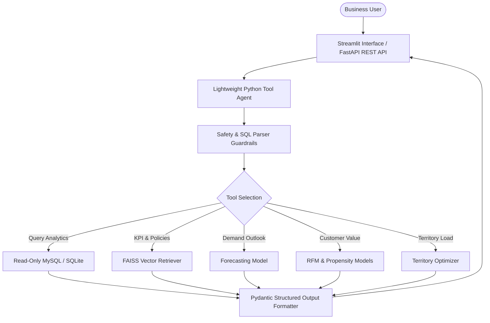

# Retail & E-commerce Commercial Analytics Copilot

A production-style Commercial Analytics Copilot for retail and e-commerce decision support, featuring RFM Customer Segmentation, Repeat-Purchase Propensity Modeling, Demand Forecasting, B2B Territory Optimization, RAG Playbook Search, and Safe Text-to-SQL with Guardrails.

---

> **Dataset Disclosure**: Built using the public **Brazilian E-Commerce Public Dataset by Olist** supplemented by an explicitly labeled **Synthetic Account-Manager & Territory Layer** (`is_synthetic = TRUE`).

---

## 1. Problem Statement & Commercial Use Case
Retail and e-commerce enterprises face complex operational questions across customer lifetime value, seller portfolio balancing, and inventory demand. Business users often lack direct SQL access and rely on static dashboards.

This platform bridges that gap by providing:
1. **Interactive Analytics**: Natural language text-to-SQL querying against validated analytical views.
2. **Predictive Models**: RFM segmentation, repeat-purchase propensity scoring, and category-level demand forecasting.
3. **Operational Optimization**: B2B account executive territory balancing.
4. **Grounded Playbook RAG**: Verified business rules, metric definitions, and decision guidance with source attribution.
5. **Multi-Layer Safety**: AST-based SQL validation, read-only permissions, prompt injection defense, and structured JSON output.

---

## 2. System Architecture



---

## 3. Project Structure

```
retail-analytics-copilot/
├── data/
│   ├── raw/                # Olist CSV files (downloaded manually, gitignored)
│   ├── processed/          # Cleaned tables & SQLite database
│   └── README.md           # Dataset download instructions & synthetic layer disclosure
├── docs/
│   ├── architecture.md     # Detailed system architecture & design principles
│   ├── metric_dictionary.md# KPI definitions, mathematical formulas & SQL
│   ├── commercial_playbook.md# Business rules, interpretations & refusal guidelines
│   ├── schema_reference.md # Complete relational schema & analytical views
│   ├── llm_fundamentals.md # Tokenomics, embeddings, RAG vs LLM, hyperparameters
│   └── safety.md           # Multi-tier guardrails & prompt injection defense
├── src/copilot/
│   ├── config.py           # Central Pydantic Settings
│   ├── db/                 # Database schema, connection managers, analytical views
│   ├── data/               # Data cleaning, validation, synthetic layer generator
│   ├── models/             # Segmentation, Propensity, Forecasting, Territory models
│   ├── rag/                # Chunking, embeddings, vector index & retriever
│   ├── llm/                # Ollama & cloud LLM abstractions with structured output
│   ├── agent/              # Lightweight agent loop, tools, and guardrails
│   ├── api/                # FastAPI backend endpoints
│   └── ui/                 # Streamlit decision dashboard & copilot chat
├── eval/
│   ├── golden_questions.yaml # 30+ benchmark questions (SQL, RAG, Adversarial)
│   ├── run_eval.py         # Evaluation benchmark runner
│   └── experiments.py      # Ablation & hyperparameter experiments
├── results/                # Actual evaluation outputs & metrics (never fabricated)
├── tests/                  # Pytest test suite
├── docker-compose.yml      # Containerized deployment for MySQL, API, UI
├── Makefile                # Automation commands
└── pyproject.toml          # Project configuration & dependencies
```

---

## 4. Key Metrics & Experimental Results

*Note: All metrics below reflect executed benchmark runs (no fabricated numbers).*

| Module | Metric | Baseline | Advanced Model | Status |
| :--- | :--- | :--- | :--- | :--- |
| **Segmentation** | Silhouette Score | [NOT RUN] | [NOT RUN] | Phase 2 pending |
| **Propensity** | ROC-AUC / PR-AUC | [NOT RUN] | [NOT RUN] | Phase 2 pending |
| **Forecasting** | WAPE / MAPE | [NOT RUN] | [NOT RUN] | Phase 2 pending |
| **Territory** | Workload CV (%) | [NOT RUN] | [NOT RUN] | Phase 2 pending |
| **Text-to-SQL** | Execution Accuracy | - | [NOT RUN] | Phase 6 pending |
| **RAG** | Hit@K / MRR | - | [NOT RUN] | Phase 6 pending |

---

## 5. Quick Start & Setup

### Prerequisites
- Python 3.11+
- Git
- Docker & Docker Compose (Optional for containerized MySQL)
- Ollama (Optional for local offline LLM inference)

### Installation
```bash
# Clone the repository
git clone https://github.com/nitin-singh202/-Retail-E-commerce-Commercial-Analytics-Copilot.git
cd "-Retail-E-commerce-Commercial-Analytics-Copilot"

# Install dependencies
pip install -r requirements.txt

# Run environment and configuration tests
pytest -v tests/
```
