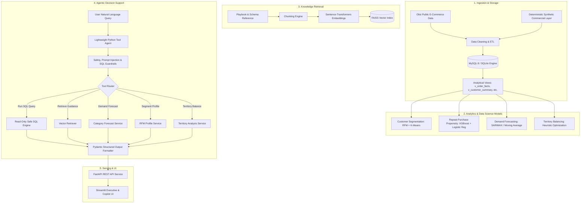

# System Architecture

## 1. High-Level Flow

## 2. Component Design Principles
- **Separation of Concerns**: Data transformations, statistical models, RAG retrieval, agent tooling, and API routing operate as decoupled modules.
- **Explainability & Transparency**: The agent provides strict evidence attribution, displaying SQL queries, tool invocations, confidence levels, and model caveats.
- **Fail-Safe Operation**: Read-only database execution, strict query limits, prompt-injection defense, and structured validation prevent runaway errors.
